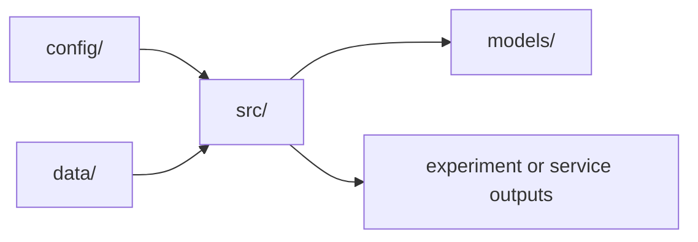
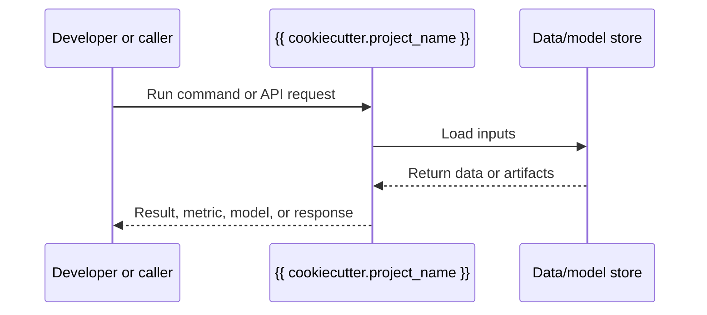

# C4 Architecture - {{ cookiecutter.project_name }}

This document captures the architecture of `{{ cookiecutter.project_name }}`.
It is mandatory for production services and optional for experiment-only
codebases. Update it whenever service boundaries, deployment topology, data
flow, storage, APIs, model calls, or major components change.

For production services, keep diagrams embedded in this Markdown file so review
can happen directly in the PR.

## Level 1 - System Context

Who uses this system and which external systems it depends on.

```mermaid
flowchart LR
    user[User or upstream service]
    project[{{ cookiecutter.project_name }}]
    external[External dependency]

    user -->|requests work| project
    project -->|reads/writes/calls| external
```

## Level 2 - Containers

The deployable units and backing services. For a library or experiment repo,
use this section to show execution environments such as notebooks, training
jobs, evaluation scripts, data stores, and model artifact locations.

```mermaid
flowchart TB
    subgraph repo[{{ cookiecutter.directory_name }}]
        app[Python package: {{ cookiecutter.project_name }}]
        tests[Test suite]
        docs[Documentation]
    end

    app --> tests
    docs --> app
```

## Level 3 - Components

The major modules inside the application or experiment workflow.



## Level 4 - Dynamic Flows

Document the most important runtime or experiment flows. Include request,
training, evaluation, deployment, and rollback flows as applicable.



## Operational Notes

- Runtime environments:
- Data stores and artifact paths:
- Secrets and configuration sources:
- Observability and logs:
- Failure modes and rollback strategy:

## Review Checklist

- Diagrams match the current code and deployment topology.
- External dependencies and ownership boundaries are named.
- Data, model, and artifact paths are documented.
- Architecture changes are reflected in `docs/engineering-logs.md`.
